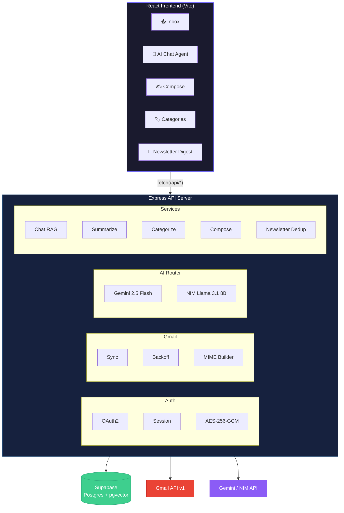
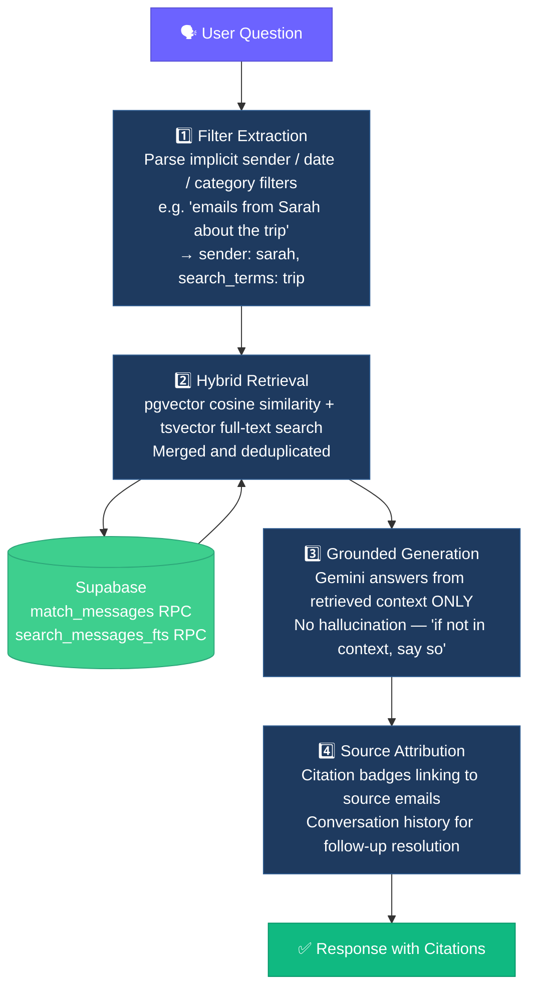
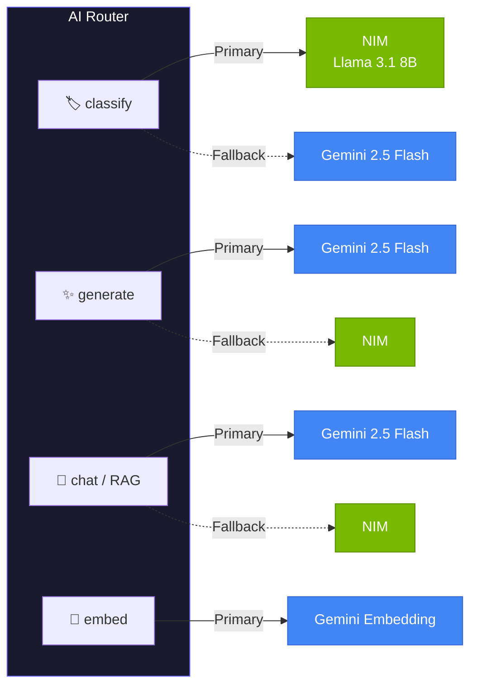
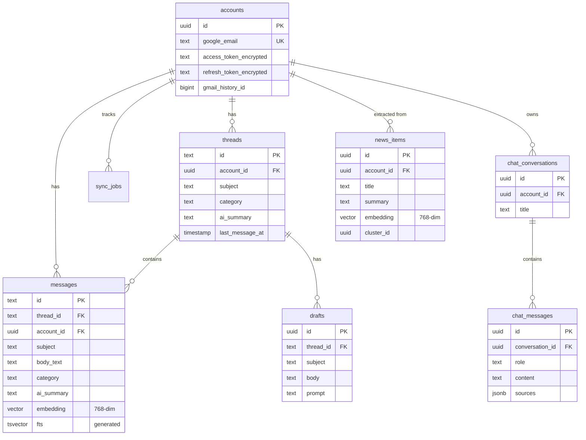

# Gmail Repeatless

**AI-powered Gmail intelligence platform — sync, categorize, summarize, compose, and chat with your inbox.**

Built with Node.js · Express · Supabase (pgvector) · Gemini 2.5 Flash · NVIDIA NIM

---

## Quick Start

```bash
# 1. Clone & install
git clone <repo-url> && cd gmail_repeatless
npm install && cd backend && npm install && cd ..

# 2. Configure
cp backend/.env.example backend/.env   # Fill in credentials

# 3. Database (run in Supabase SQL Editor)
#    → backend/src/db/schema.sql
#    → backend/src/db/functions.sql

# 4. Build & run
npm run build && cd backend && npm start
# → http://localhost:3001
```

<details>
<summary><strong>Development mode (two terminals)</strong></summary>

```bash
# Terminal 1: Frontend with HMR
npm run dev

# Terminal 2: Backend with watch
cd backend && npm run dev
```

Vite proxies `/api/*` to Express on port 3001.
</details>

<details>
<summary><strong>🔐 Gmail OAuth Setup (Step-by-Step)</strong></summary>

### Prerequisites
- A Google account (Gmail)
- Access to [Google Cloud Console](https://console.cloud.google.com/)

### Step 1: Create a Google Cloud Project

1. Go to [Google Cloud Console](https://console.cloud.google.com/)
2. Click the project dropdown (top-left) → **New Project**
3. Name it `gmail-repeatless` (or anything you prefer)
4. Click **Create** and wait for it to provision
5. Make sure this project is selected in the dropdown

### Step 2: Enable the Gmail API

1. Go to **APIs & Services** → **Library** (or search "Gmail API" in the top search bar)
2. Search for **Gmail API**
3. Click on it → Click **Enable**
4. Wait for it to activate (takes a few seconds)

### Step 3: Configure OAuth Consent Screen

1. Go to **APIs & Services** → **OAuth consent screen**
2. Select **External** user type → Click **Create**
3. Fill in the required fields:
   - **App name**: `Gmail Repeatless`
   - **User support email**: your email
   - **Developer contact email**: your email
4. Click **Save and Continue**
5. On the **Scopes** page, click **Add or Remove Scopes** and add these:
   ```
   https://www.googleapis.com/auth/gmail.readonly
   https://www.googleapis.com/auth/gmail.send
   https://www.googleapis.com/auth/gmail.modify
   https://www.googleapis.com/auth/userinfo.email
   https://www.googleapis.com/auth/userinfo.profile
   ```
6. Click **Update** → **Save and Continue**
7. On the **Test users** page, click **Add Users**
8. Enter **your Gmail address** (e.g., `yourname@gmail.com`)
9. Click **Add** → **Save and Continue**
10. Click **Back to Dashboard**

> ⚠️ **Important**: While the app is in "Testing" mode, only the test users you add can log in. This is expected — you don't need to publish the app for personal use.

### Step 4: Create OAuth2 Credentials

1. Go to **APIs & Services** → **Credentials**
2. Click **+ Create Credentials** → **OAuth client ID**
3. Application type: **Web application**
4. Name: `Gmail Repeatless Web`
5. Under **Authorized redirect URIs**, click **Add URI** and enter:
   ```
   http://localhost:3001/api/auth/google/callback
   ```
6. Click **Create**
7. A dialog will show your **Client ID** and **Client Secret** — copy both!

### Step 5: Add Credentials to `.env`

Open `backend/.env` and fill in:

```env
# Google OAuth2
GOOGLE_CLIENT_ID=your-client-id-here.apps.googleusercontent.com
GOOGLE_CLIENT_SECRET=GOCSPX-your-client-secret-here
GOOGLE_REDIRECT_URI=http://localhost:3001/api/auth/google/callback
```

### Step 6: Generate Security Keys

Run these commands to generate secure random keys:

```bash
# Generate TOKEN_ENCRYPTION_KEY (32-byte hex)
node -e "console.log(require('crypto').randomBytes(32).toString('hex'))"

# Generate SESSION_SECRET
node -e "console.log(require('crypto').randomBytes(32).toString('hex'))"
```

Add them to `backend/.env`:

```env
TOKEN_ENCRYPTION_KEY=<paste-first-output>
SESSION_SECRET=<paste-second-output>
```

### Verification

After starting the server (`cd backend && npm start`), visit:
```
http://localhost:3001/api/auth/google
```

You should see the Google consent screen asking to sign in. After authorizing, you'll be redirected back to the app.

### Common Issues

| Issue | Fix |
|---|---|
| `redirect_uri_mismatch` | Make sure `http://localhost:3001/api/auth/google/callback` is in your authorized redirect URIs (exact match) |
| `access_denied` | Add your email as a test user in OAuth consent screen |
| `invalid_client` | Double-check Client ID and Secret in `.env` |
| `API not enabled` | Go to APIs & Services → Library → Enable Gmail API |

</details>

<details>
<summary><strong>🗄️ Supabase Setup</strong></summary>

### Step 1: Create a Supabase Project

1. Go to [supabase.com](https://supabase.com/) → Sign up / Log in
2. Click **New Project**
3. Choose an organization, name it `gmail-repeatless`, set a database password
4. Select a region close to you → Click **Create new project**
5. Wait for provisioning (~2 minutes)

### Step 2: Enable pgvector

1. Go to **SQL Editor** in your Supabase dashboard
2. Run:
   ```sql
   create extension if not exists vector;
   ```

### Step 3: Create the Database Schema

1. Open `backend/src/db/schema.sql` from this repo
2. Copy its entire contents into the **SQL Editor** → Click **Run**
3. Then open `backend/src/db/functions.sql` and run that too

### Step 4: Get Your Credentials

1. Go to **Settings** → **API**
2. Copy:
   - **Project URL** (e.g., `https://xxxxx.supabase.co`)
   - **Service Role Key** (under "Project API keys" — the `service_role` one, NOT `anon`)

3. Add to `backend/.env`:
   ```env
   SUPABASE_URL=https://xxxxx.supabase.co
   SUPABASE_SERVICE_ROLE_KEY=eyJhbGci...your-service-role-key
   ```

> ⚠️ Use the **service_role** key (not the anon key). This key has full database access and should never be exposed to the frontend.

</details>

<details>
<summary><strong>🤖 AI API Keys (Gemini + NVIDIA NIM)</strong></summary>

### Gemini API Key

1. Go to [Google AI Studio](https://aistudio.google.com/apikey)
2. Click **Create API Key**
3. Select your Google Cloud project (or create one)
4. Copy the key and add to `backend/.env`:
   ```env
   GEMINI_API_KEY=AIzaSy...your-gemini-key
   ```

> 💡 The free tier allows 15 RPM for `gemini-2.5-flash` and 1500 RPM for `gemini-embedding-001`. For production use, enable billing for higher limits.

### NVIDIA NIM API Key

1. Go to [build.nvidia.com](https://build.nvidia.com/)
2. Sign up / Log in with your NVIDIA account
3. Navigate to any model (e.g., `meta/llama-3.1-8b-instruct`)
4. Click **Get API Key** → Copy it
5. Add to `backend/.env`:
   ```env
   NVIDIA_NIM_API_KEY=nvapi-...your-nim-key
   NVIDIA_NIM_BASE_URL=https://integrate.api.nvidia.com/v1
   NVIDIA_NIM_MODEL=meta/llama-3.1-8b-instruct
   ```

> 💡 NIM provides 1000 free API calls. The app uses NIM for cheap classification tasks, so this goes a long way.

### Complete `.env` Example

```env
# Server
PORT=3001
NODE_ENV=development

# Supabase
SUPABASE_URL=https://xxxxx.supabase.co
SUPABASE_SERVICE_ROLE_KEY=eyJhbGci...

# Google OAuth2
GOOGLE_CLIENT_ID=xxxxx.apps.googleusercontent.com
GOOGLE_CLIENT_SECRET=GOCSPX-xxxxx
GOOGLE_REDIRECT_URI=http://localhost:3001/api/auth/google/callback

# Gemini AI
GEMINI_API_KEY=AIzaSy...
GEMINI_CHAT_MODEL=gemini-2.5-flash
GEMINI_EMBEDDING_MODEL=gemini-embedding-001

# NVIDIA NIM
NVIDIA_NIM_API_KEY=nvapi-...
NVIDIA_NIM_BASE_URL=https://integrate.api.nvidia.com/v1
NVIDIA_NIM_MODEL=meta/llama-3.1-8b-instruct

# Security (generate with: node -e "console.log(require('crypto').randomBytes(32).toString('hex'))")
TOKEN_ENCRYPTION_KEY=<random-64-char-hex>
SESSION_SECRET=<random-64-char-hex>

# Frontend
FRONTEND_URL=http://localhost:3000
```

</details>

---

## Project Structure

```
gmail_repeatless/
├── backend/                        # Express.js API server
│   ├── server.js                   # Entry point — mounts routes, starts sync/categorization
│   ├── .env.example                # Environment variable template with descriptions
│   ├── src/
│   │   ├── config/index.js         # Centralized config from environment variables
│   │   ├── auth/
│   │   │   ├── oauth.js            # Google OAuth2 flow (consent → token exchange)
│   │   │   ├── session.js          # Express session middleware + requireAuth guard
│   │   │   └── crypto.js           # AES-256-GCM encryption for OAuth tokens
│   │   ├── gmail/
│   │   │   ├── client.js           # Gmail API client factory (auto-refreshes tokens)
│   │   │   ├── sync.js             # Full sync + incremental sync orchestration
│   │   │   ├── backoff.js          # Exponential backoff with jitter for Gmail API
│   │   │   └── mime.js             # RFC 2822 MIME builder for sending emails
│   │   ├── ai/
│   │   │   ├── router.js           # Dual-model router with priority + fallback + retry
│   │   │   ├── gemini.js           # Gemini 2.5 Flash client (generate + embed)
│   │   │   ├── nim.js              # NVIDIA NIM client (OpenAI-compatible)
│   │   │   └── prompts/index.js    # All prompt templates (summarize, categorize, RAG, etc.)
│   │   ├── services/
│   │   │   ├── chatAgent.js        # RAG pipeline: filter → retrieve → generate → cite
│   │   │   ├── categorization.js   # Batch email classification (6 categories)
│   │   │   ├── summarization.js    # Per-message and per-thread summarization
│   │   │   ├── compose.js          # AI email composition and reply drafting
│   │   │   └── newsletterDedup.js  # Newsletter item extraction and deduplication
│   │   ├── routes/
│   │   │   ├── auth.js             # /api/auth/* — OAuth login/callback/logout
│   │   │   ├── sync.js             # /api/sync/* — Trigger sync, check status
│   │   │   ├── threads.js          # /api/threads/* — List threads, get messages
│   │   │   ├── chat.js             # /api/chat/* — Conversations and AI messages
│   │   │   ├── compose.js          # /api/compose/* — Draft and send emails
│   │   │   ├── categories.js       # /api/categories/* — Category counts and filters
│   │   │   └── newsletters.js      # /api/newsletters/* — Newsletter digest
│   │   ├── db/
│   │   │   ├── client.js           # Supabase client singleton
│   │   │   ├── schema.sql          # Full database schema (7 tables + indexes)
│   │   │   └── functions.sql       # pgvector RPC functions (match_messages, search_messages_fts)
│   │   └── middleware/
│   │       ├── logger.js           # Structured logging with API call tracking
│   │       ├── errorHandler.js     # Global error handler
│   │       └── rateLimiter.js      # Express rate limiter
│   └── package.json
├── src/                            # React frontend (Vite + TypeScript)
│   ├── App.tsx                     # Main app shell with view routing
│   ├── main.tsx                    # React entry point
│   ├── index.css                   # Global styles + design tokens
│   ├── api.ts                      # API client (fetch wrapper with auth)
│   ├── types.ts                    # TypeScript type definitions
│   └── components/
│       ├── Sidebar.tsx             # Navigation sidebar with category counts
│       ├── InboxView.tsx           # Email thread list with search
│       ├── AIChatAgent.tsx         # Conversational AI chat interface
│       ├── ComposeView.tsx         # AI-powered email compose/reply
│       ├── CategoriesView.tsx      # Category-filtered email views
│       └── NewsletterDigest.tsx    # Newsletter intelligence dashboard
├── evals/                          # AI evaluation framework
│   ├── eval-categorization.js      # Classification accuracy tests
│   ├── eval-chat.js                # RAG retrieval quality tests
│   ├── eval-summarization.js       # Summary quality tests
│   └── llm-judge.js               # LLM-as-judge evaluation
├── Architecture.md                 # Detailed architecture & design document
├── vite.config.ts                  # Vite config with API proxy
├── index.html                      # SPA entry point
└── package.json                    # Frontend dependencies + scripts
```

> 📖 For detailed architecture, AI design, database schema, and trade-off analysis, see **[Architecture.md](./Architecture.md)**.

---

## Architecture



**Single-service deployment**: Express serves both the API and the Vite-built SPA from `dist/`. One process, no CORS, no reverse proxy.

---

## Features

### 1. Gmail Sync & Integration

| Capability | Implementation |
|---|---|
| **OAuth 2.0** | Google consent → code exchange → AES-256-GCM encrypted token storage |
| **Full sync** | Paginated `messages.list` with bounded concurrency (`p-limit(5)`) |
| **Incremental sync** | `history.list` from stored `historyId` — fetches only deltas |
| **Rate limiting** | Exponential backoff with jitter, `Retry-After` header support, 429/403/5xx handling |
| **Thread building** | Messages auto-grouped into thread records; progressive build during sync |

Tested with **2,700+ messages** — handles pagination, thread building, and progressive UI updates without degradation.

### 2. Email Summarization

- **Per-message**: Generated during sync, cached in DB (not regenerated on read)
- **Per-thread**: Understands the full conversation arc — all messages fed in chronological order
- **Context-aware**: Replies understood in context of the thread, not in isolation

### 3. Compose & Reply

- **Compose**: Natural-language prompt → AI generates subject + body → user reviews/edits → sends via Gmail API
- **Reply**: Full thread history injected into prompt → contextual reply with correct tone
- **Threading**: RFC 2822 compliant MIME with `In-Reply-To` and `References` headers — replies appear correctly in Gmail threads

### 4. Email Categorization

Six categories: **Newsletter** · **Job/Recruitment** · **Finance** · **Notifications** · **Personal** · **Work/Professional**

- NIM handles high-volume classification (primary); Gemini as fallback
- Thread-level propagation: dominant message category becomes the thread category
- Stored in Supabase, surfaced as filterable tabs in the UI

### 5. AI Chat Agent — RAG Pipeline

The centerpiece. A 4-step pipeline that treats the user's inbox as an exclusive knowledge base:



Handles cross-email reasoning, multi-thread synthesis, and conversational follow-ups.

### 6. Newsletter Deduplication (Bonus)

- **Extract**: Gemini structured output pulls `{title, summary, url}` from newsletter bodies
- **Embed**: Each item embedded via `gemini-embedding-001` at 768 dimensions
- **Cluster**: Greedy pairwise cosine similarity (threshold ≥ 0.85)
- **Digest**: Clustered items collapsed to one entry, all source newsletters attributed

---

## AI Model Strategy



On failure (429, 500, timeout), the router automatically switches to the fallback provider. Both fail → clear error message, no silent degradation.

**Why two models?**
- **Gemini 2.5 Flash**: Excels at multi-step reasoning, 1M token context, native embeddings, structured JSON output. Used for RAG synthesis, thread-aware replies, and summarization.
- **NIM (Llama 3.1 8B)**: Lightweight, fast, no rate limit pressure. Email categorization is a 6-class classification task — an 8B model handles this reliably without burning Gemini quota.

---

## Database Schema

7 tables designed for email-first access patterns:



| Table | Purpose | Key Design Choices |
|---|---|---|
| `accounts` | Connected Gmail accounts | AES-256-GCM encrypted OAuth tokens |
| `threads` | Gmail threads as first-class entities | Single category (not M:N), AI summary cached |
| `messages` | Individual emails | `vector(768)` embeddings, `tsvector` FTS column |
| `sync_jobs` | Sync operation tracking | Resumability, progress monitoring |
| `drafts` | AI-generated email drafts | Audit trail (prompt → draft → sent) |
| `chat_conversations` / `chat_messages` | AI chat history | Source citations persisted per message |
| `news_items` | Newsletter items for dedup | Embeddings + `cluster_id` for similarity grouping |

**Design decisions:**
- **Category as single value**: Most emails have one dominant category. A tags table adds joins for minimal benefit at this scale.
- **768-dim embeddings**: `gemini-embedding-001` with `output_dimensionality: 768` — compact, fast, semantically rich. 10K emails ≈ 30MB index.
- **Hybrid search**: Vector misses exact terms ("CVE-2026-1182"); FTS misses semantics ("billing" ≈ "overages"). The RAG pipeline merges both.
- **Encrypted tokens**: Even a full database dump reveals nothing useful. ~30 lines using Node.js built-in `crypto`.

---

## API Reference

| Method | Endpoint | Description |
|---|---|---|
| `GET` | `/api/auth/google/url` | Google OAuth consent URL |
| `GET` | `/api/auth/google/callback` | OAuth2 callback handler |
| `GET` | `/api/auth/session` | Check current auth session |
| `POST` | `/api/auth/logout` | Destroy session |
| `POST` | `/api/sync/start` | Start full or incremental sync |
| `GET` | `/api/sync/status` | Latest sync job status |
| `GET` | `/api/threads` | List threads (paginated, filterable by category) |
| `GET` | `/api/threads/:id` | Thread with full message data |
| `POST` | `/api/threads/:id/summarize` | Generate/refresh thread summary |
| `POST` | `/api/compose` | Generate new email draft from prompt |
| `POST` | `/api/threads/:id/reply` | Generate reply with thread context |
| `POST` | `/api/send` | Send email via Gmail API |
| `GET` | `/api/categories` | Category distribution stats |
| `POST` | `/api/chat/conversations` | Create new chat conversation |
| `GET` | `/api/chat/conversations` | List conversations |
| `POST` | `/api/chat/conversations/:id/messages` | Send message to AI chat agent |
| `GET` | `/api/newsletters/digest` | Deduplicated newsletter digest |

---

## Project Structure

```
gmail_repeatless/
├── src/                              # React frontend
│   ├── App.tsx                       # Main app with auth + sync flow
│   ├── api.ts                        # Centralized API client
│   ├── types.ts                      # TypeScript interfaces
│   └── components/                   # InboxView, AIChatAgent, ComposeView, etc.
├── backend/
│   ├── server.js                     # Express entry point (API + static)
│   ├── .env.example                  # Environment variable template
│   └── src/
│       ├── config/index.js           # Config + category mappings
│       ├── db/
│       │   ├── schema.sql            # Full database schema (7 tables)
│       │   ├── functions.sql         # pgvector RPC functions
│       │   └── client.js             # Supabase client singleton
│       ├── auth/
│       │   ├── oauth.js              # Google OAuth2 flow
│       │   ├── crypto.js             # AES-256-GCM token encryption
│       │   └── session.js            # Session middleware
│       ├── gmail/
│       │   ├── sync.js               # Full + incremental sync
│       │   ├── backoff.js            # Exponential backoff with jitter
│       │   ├── mime.js               # RFC 2822 message builder
│       │   └── client.js             # Gmail API client factory
│       ├── ai/
│       │   ├── router.js             # Dual-model routing + fallback
│       │   ├── gemini.js             # Gemini generation + embeddings
│       │   ├── nim.js                # NVIDIA NIM classification
│       │   └── prompts/index.js      # All prompt templates (one file)
│       ├── services/
│       │   ├── chatAgent.js          # RAG pipeline (4-step)
│       │   ├── summarization.js      # Per-message + per-thread
│       │   ├── categorization.js     # NIM→Gemini fallback chain
│       │   ├── compose.js            # Draft generation
│       │   └── newsletterDedup.js    # Extract → embed → cluster
│       ├── routes/                   # Express route handlers
│       └── middleware/               # Error handler, rate limiter, logger
└── evals/                            # Evaluation suite
    ├── run-evals.js                  # Main runner (unit, judge, human)
    ├── llm-judge.js                  # LLM-as-Judge with rubrics
    ├── human-eval.js                 # Human evaluation form generator
    ├── fixtures.js                   # 30+ test scenarios
    └── eval-*.js                     # Per-feature evaluation suites
```

---

## Evaluation Framework

Three-tier evaluation pyramid:

| Tier | Method | What It Tests |
|---|---|---|
| **Unit tests** | Keyword/structure assertions | Format, categories, required fields — fast, deterministic |
| **LLM-as-Judge** | Gemini evaluates with rubrics (1-5 scale) | Quality, conciseness, accuracy, hallucination — nuanced |
| **Human eval** | Manual scoring forms | Final sign-off on subjective quality |

```bash
cd evals && npm install

# Run all unit tests
node run-evals.js --mode unit

# Run LLM-as-Judge evaluation
node run-evals.js --mode judge

# Generate human evaluation forms
node run-evals.js --mode human
```

---

## Key Design Decisions

### Why single-service Express?
CORS elimination, single `npm start` deployment, zero setup friction for assessors. At scale, this would split into API Gateway + CDN.

### Why plain JavaScript (no TypeScript)?
The assessment values "functional over over-engineered." TypeScript adds a build step, `tsconfig.json`, and source maps for ~30 backend files. JSDoc provides type hints without build complexity.

### Why manual MIME (not Nodemailer)?
Gmail requires `In-Reply-To` and `References` headers for thread-correct replies. The MIME builder is ~60 lines. Nodemailer (2MB, 25 transitive deps) for header construction is excessive.

### Why category as single value (not M:N tags)?
The frontend treats category as a single badge. Most emails have one dominant category. A tags table adds 3 tables + JOINs for 6 categories — premature complexity. If multi-label were needed, `text[]` arrays work without join overhead.

### Why NOT ReAct/agent loops?
The RAG pipeline is a fixed 4-step sequence (filter → retrieve → generate → cite). Agentic loops introduce unpredictable latency and harder debugging. A fixed pipeline is more auditable and testable.

---

## Trade-offs & What Changes at Scale

| Decision | Current (Assessment) | At Scale (Production) |
|---|---|---|
| Session storage | In-memory | Redis with `connect-redis` |
| Sync architecture | Inline in request | BullMQ background job queue |
| Embedding generation | Synchronous per-message | Batch embeddings + Redis cache |
| Categorization model | NIM API per message | Fine-tuned Gemma 2 2B on GPU |
| Sync trigger | User-initiated | Gmail Watch API (push notifications) |
| Rate limiting | In-memory sliding window | Redis-based distributed limiter |
| Chat response | Full response | SSE/WebSocket streaming |
| Frontend hosting | Express-served SPA | CDN + API Gateway |

---

## Environment Variables

```bash
# Server
PORT=3001
NODE_ENV=development

# Supabase
SUPABASE_URL=https://<ref>.supabase.co
SUPABASE_SERVICE_ROLE_KEY=<service-role-jwt>

# Google OAuth2
GOOGLE_CLIENT_ID=<client-id>.apps.googleusercontent.com
GOOGLE_CLIENT_SECRET=GOCSPX-<secret>
GOOGLE_REDIRECT_URI=http://localhost:3001/api/auth/google/callback

# AI Models
GEMINI_API_KEY=<gemini-key>
NVIDIA_NIM_API_KEY=<nim-key>

# Security
TOKEN_ENCRYPTION_KEY=<64-char-hex>    # openssl rand -hex 32
SESSION_SECRET=<64-char-hex>          # openssl rand -hex 32

# Frontend
FRONTEND_URL=http://localhost:3000
```

---

## Deployment

### Railway / Render

1. Push to GitHub
2. Connect repo in Railway/Render dashboard
3. Set environment variables in provider dashboard
4. Build command: `npm run build`
5. Start command: `cd backend && node server.js`
6. Update `GOOGLE_REDIRECT_URI` and `FRONTEND_URL` to production URL

The Express server automatically serves the Vite build from `dist/` and handles SPA routing with `trust proxy` enabled for secure cookies behind reverse proxies.
